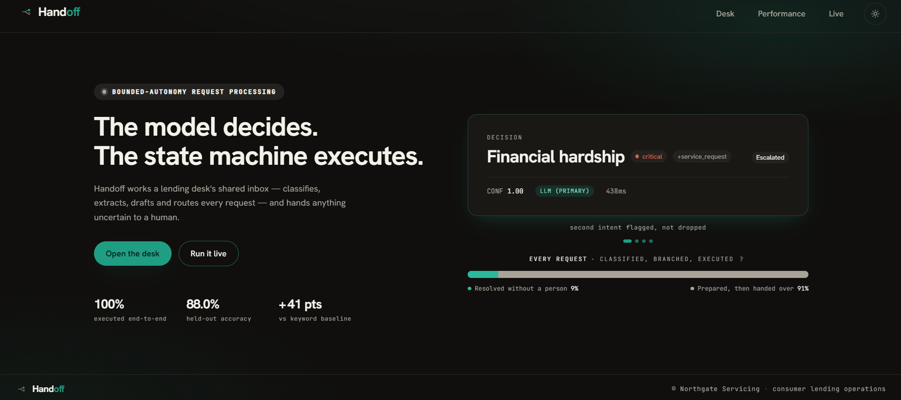
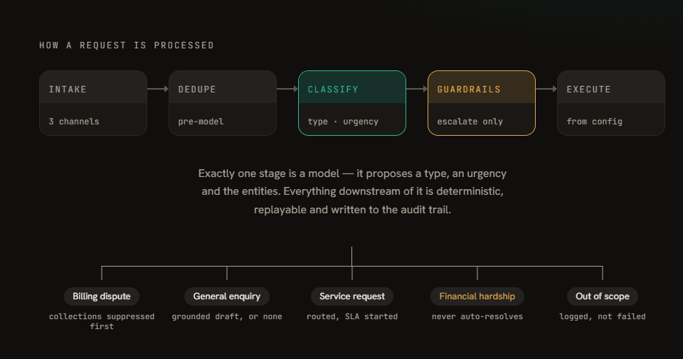
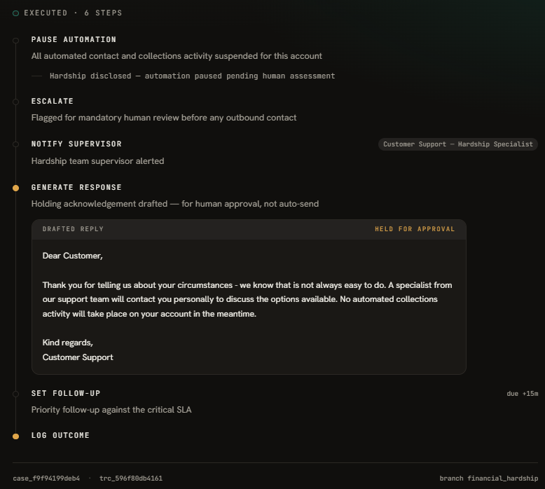
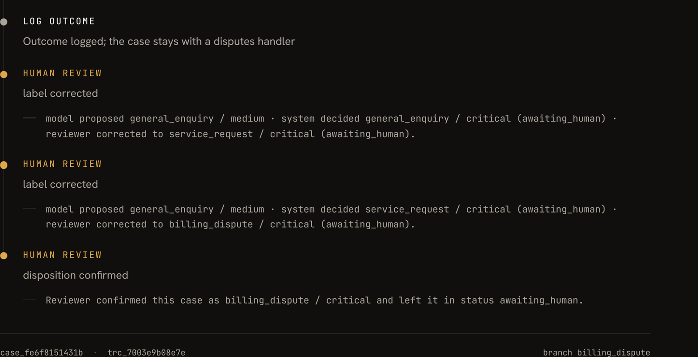
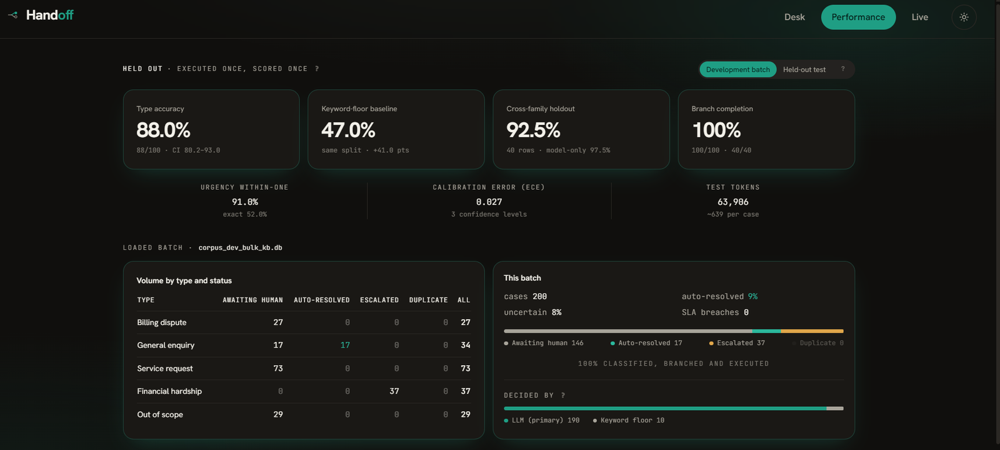

<div align="center">


# Handoff

**Bounded-autonomy request triage for a lending operations desk.**
Every request classified, branched and executed — anything uncertain handed to a person, on purpose.


</div>

> **On the two names.** The repository is `Request-Triage` — what the system does.
> **Handoff** is what the product is called, after the thing it is actually built
> around: the moment it stops, and gives a case to a person.

<div align="center">

</div>


---

A lending operations desk takes a continuous stream of requests by email, web form and shared inbox. Today a person reads every one of them and decides what happens next — which is *slow*, *inconsistent*, and *dependent on individual judgment*. Those three words are the design targets.

Handoff reads each request, classifies it by **type** and **urgency** as independent axes, runs a deterministic branch of remediation steps, and hands anything it cannot safely finish to a person. **The model decides. The state machine executes.**

Every number below is measured on a held-out split that was executed once and scored once. None of it is asserted.

## Try it

| | What | Where |
|---|---|---|
| 🌐 **Live app** | Opens cold in demo mode from committed batch data — no keys, no network | **[handoff-triage.vercel.app](https://handoff-triage.vercel.app)** |
| ▶ **Demo** | 3-minute narrated walkthrough: classification, guardrail escalation, duplicate suppression, provider outage, human override | **[Watch](https://drive.google.com/file/d/1VyTk0n66fB1LlFOP8a9ld2dlqyUwe834/view?usp=sharing)** |
| 🖥️ **Live mode** | Paste your own message, run it through the real pipeline, simulate a provider outage, override the result | [/live](https://handoff-triage.vercel.app/live) |
| 📈 **Reproduce the numbers** | Recompute every published figure from committed runs, zero API calls | [below](#setup) |

## Setup

```bash
git clone https://github.com/ayushgupta07xx/Request-Triage.git
cd Request-Triage

python3 -m venv .venv && source .venv/bin/activate
pip install -r requirements.txt
cp .env.example .env          # GROQ_API_KEY; GEMINI_API_KEY only for holdout generation
```

**Reproduce every published number — no API key required.** Both commands read
committed run artefacts under `data/runs/` and recompute offline.

```bash
python3 scripts/run_eval.py --run corpus_test70_v2 --floor corpus_test_floor   # the headline split
python3 scripts/run_eval.py --run holdout70_v2                                 # cross-family holdout
```

**Check the safety properties, not just the metrics.** 27 tests, offline, no key,
0.13s. They assert the design claims directly: guardrails escalate only, the
keyword floor is capped and never closes a case, `grounded: true` is enforced
rather than documented, every branch runs at least two valid steps.

```bash
python3 -m pytest -q
```

**Run the console locally.**

```bash
cd web && npm install && npm run dev        # demo mode, no keys needed
```

**Process a split yourself** (this one does need a key), then bake it into the console:

```bash
python3 scripts/run_batch.py --split dev --tier bulk
python3 scripts/export_demo.py --db data/runs/corpus_dev_bulk.db --out web/public/demo-dev200.json
```

Sample inputs, one per branch, are in `data/samples/`; the full 330-example
corpus is in `data/corpus/`.

## How a request is processed

<div align="center">

<br><sub>Rendered inside the product, not drawn for the README.</sub>
</div>

<br>

**Classification is the only place the model acts.** It proposes a type, an
urgency, extracted entities and a rationale. That proposal is stored as a
*separate record* from the final decision, so the audit trail always answers
*what did the model say* versus *what did the system decide*.

**Everything after classification is deterministic.** Control flow, side effects
and every drafted word are code and configuration, never model output. Four
independent gates can demote a case toward a human; **none can promote one.**

| Gate | What it does |
|---|---|
| **Guardrails** | Five deterministic phrase tiers, run on raw text *before* the proposal is trusted: `hardship_disclosure` (forces the type), `hardship_possible` (holds for review without forcing it), `vulnerability_indicator`, `regulatory_escalation`, `complaint_language`. Escalate only — they can force a more serious type or raise urgency, never the reverse. |
| **Confidence** | Per-class thresholds on the quality tier, derived by sweep. On the bulk tier, an ensemble: the model and the keyword floor must agree *and* confidence must be 1.00. A model with no derived entry never auto-handles anything. |
| **Grounding** | An enquiry draft composes only from a matched knowledge-base entry and cites its source. No match, an ambiguous match, or a blocked topic means no auto-resolve. `grounded: true` in config is an enforced contract, not a comment. |
| **Provider floor** | Keyword-decided rows are capped at 0.60 confidence and always route to a human. A degraded system stays available; it never becomes more autonomous. |

**Degradation is a three-tier waterfall** — Groq 70B → Groq 8B → deterministic
keyword floor. Production degrades to stay fast. Measurement runs pin to a
single tier (`--pin`), because a silent same-family swap contaminates
provenance. Every case records which tier decided it.

**Duplicate suppression** happens on a content fingerprint *before* any model
call, inside a configurable window. No second acknowledgement, no double
routing, no tokens spent.

**Branches are data.** `triage/workflows.yaml` holds every step, routing target,
SLA and guardrail phrase, validated against schema enums at load. An operations
manager adds a request type by editing config — no developer, no deploy.

## Remediation branches

<div align="center">

<br><sub>A hardship case, end to end. The reply is drafted but <b>held for approval, not sent</b>.</sub>
</div>

<br>

Type selects the branch. Urgency modulates *within* it: it sets the SLA clock,
adds conditional steps, and routes to a senior handler above a per-branch
threshold.

| Branch | Steps, in order | Ends in |
|---|---|---|
| `billing_dispute` | draft acknowledgement → **suppress collections** → route to Disputes → SLA follow-up → log | `awaiting_human` |
| `general_enquiry` | grounded draft with cited source → log → follow-up *if high/critical* | `auto_resolved` |
| `service_request` | draft confirmation → route to Servicing Ops → **start SLA timer** → follow-up → log | `awaiting_human` |
| `financial_hardship` | **pause automation** → escalate → notify supervisor → holding draft *(not auto-sent)* → follow-up → log | `escalated` |
| `other` | route to Triage Queue → log | `awaiting_human` |

`general_enquiry` is the only branch permitted to close itself, and only when
the grounding gate passes. **The hardship branch pauses automation as its first
step and can never auto-resolve.** The asymmetry is argued from cost: a false
escalation wastes two minutes of an agent's time; a missed hardship disclosure
is a regulatory and human failure. That is not a close call.

### Action coverage

| Branch | `generate_response` | `route_to_team` | `set_follow_up` | `log_outcome` |
|---|:---:|:---:|:---:|:---:|
| `billing_dispute` | ✓ | ✓ Disputes Team | ✓ | ✓ |
| `general_enquiry` | ✓ grounded | — self-serve | ✓ conditional | ✓ |
| `service_request` | ✓ | ✓ Servicing Ops | ✓ | ✓ |
| `financial_hardship` | ✓ held for approval | — escalation path | ✓ | ✓ |
| `other` | — no auto-reply | ✓ Triage Queue | — | ✓ |

Every named action is exercised by at least two branches; every branch runs two
to six steps. Actions per case across the held-out split: min 2, mean 4.1, max 6.

## One end-to-end example per branch

| Input | Decision | What actually ran | Outcome |
|---|---|---|---|
| *"concern with mortgage arrears… please provide a breakdown of charges"* | `billing_dispute` / medium · 0.90 | draft acknowledgement → collections hold → Disputes Team → SLA follow-up → log | `awaiting_human` |
| *"my fixed rate deal is ending in September"* | `general_enquiry` / low · 1.00 | KB match `fixed_rate_expiry` → sourced draft, cited → log | `auto_resolved` |
| *"third call about my secured homeowner loan, ref HS567, need a payoff quote"* | `service_request` / high · **floor 0.40** | draft → Servicing Ops → SLA timer → follow-up → log | `awaiting_human` |
| *"struggling to pay my mortgage this month… I don't know how I'll cope"* | `financial_hardship` / critical · **guardrail override** | pause automation → escalate → notify supervisor → holding draft → follow-up → log | `escalated` |
| *"sort out my O2 upgrade, they're giving customers free 5G"* | `other` / low · 1.00 | Triage Queue → log | `awaiting_human` |

Row 4 is the whole thesis in one line: the model proposed a lesser type, the
`hardship_disclosure` guardrail overrode it, and **no automation ran at all.**

Row 3 is the second half: the keyword floor decided it, capped at 0.40, and the
branch still executed end to end — it just could not close the case.

## The human side of the handoff

<div align="center">

<br><sub>Two corrections and an approval, stacked. Nothing overwritten.</sub>
</div>

<br>

An escalation mechanism for cases the model is unsure of has two halves. The
gates are the first — they demote. This is the second.

A reviewer can override the type and urgency on any live case. When they do:

- **The corrected branch re-runs through the real engine** — not a status flip. A
  correction from enquiry to billing dispute actually suppresses collections and
  routes to Disputes.
- **The model's original proposal is preserved** alongside the system's decision
  and the human's, so the case carries all three layers permanently.
- **The disagreement is stored as a labelled training pair.** The system harvests
  its own fine-tuning data at zero extra cost.
- **Corrections stack; nothing is overwritten.** Approval is an audit record that
  a person looked, and it closes the override path. An audit trail that deletes
  its own records on the next write is not one.
- **An override cannot buy autonomy.** It bypasses the confidence gate by design —
  a reviewer outranks the model's certainty — but it still runs the grounding
  gate, because being sure of the *label* is not a source for the *draft*.

## Results

<div align="center">

</div>

Measured on a **100-example held-out split, executed once and scored once**, on
`llama-3.3-70b-versatile`, single-tier provenance verified. 63,906 tokens,
~639 per case. Latency p50 588 ms, p95 760 ms.

| | |
|---|---|
| **Type accuracy** | **88.0%** · 95% CI 80.2–93.0 |
| Keyword-floor baseline, same split | 47.0% → **+41 points** |
| Cross-family holdout (40 examples, Gemini-generated) | **92.5%** · model-only **97.5%** |
| Branch completion | **100%** · 100/100 test, 40/40 holdout |
| Urgency | 52% exact · **91% within one level** |
| Calibration error (ECE) | 0.027, over a coarse signal — only three distinct confidence values |

### Per class, held-out split

| Class | Support | Precision | Recall | F1 |
|---|---|---|---|---|
| `billing_dispute` | 20 | 94.7% | 90.0% | 0.92 |
| `general_enquiry` | 22 | 94.7% | 81.8% | 0.88 |
| `service_request` | 23 | **71.0%** | 95.7% | 0.81 |
| `financial_hardship` | 17 | 93.3% | 82.4% | 0.87 |
| `other` | 18 | 100.0% | 88.9% | 0.94 |

**`service_request` is a sink.** Nine of the twelve total errors land on it,
while every other class holds 93–100% precision. That single structural failure
mode is why it carries no auto-policy — the gate is derived from the matrix, not
asserted over it.

**What the safety layer costs.** On the cross-family holdout the model proposed
the correct type 39 times in 40 — 97.5%. The system scored 92.5%, because the
hardship guardrail overrode two of those correct calls, both on the phrase
"cannot afford". One was a disabled customer on benefits asking for a redemption
statement: the model read the surface request, the guardrail read the disclosure
underneath it. **Two thirds of the measured error is the safety layer doing its
job**, and it is priced that way deliberately.

Full confusion matrices, Wilson intervals, the threshold sweep, calibration
buckets and the floor-versus-LLM disagreement analysis are in [`docs/eval/`](docs/eval/).

## Why the gates sit where they do

Thresholds were **derived by sweep** over cached development runs against a
pre-registered bar: **≥95% precision on anything auto-handled, with a minimum
sample of n≥15 per class.** The bar was set before the numbers were seen.

On the quality tier only `billing_dispute` cleared it, at 0.90. `general_enquiry`
(88%) and `service_request` (56%) failed on merit. `other` scored 11/11 — and
still failed, on the sample bar. That bar exists precisely to resist
small-sample perfection.

**Automation is therefore 8.5% on the 200-case development batch and 0% on the
held-out split.** The second number is not a shortfall. `general_enquiry` is the
only branch whose config permits self-closure, it has no derived auto-policy on
the quality tier, and so nothing closed itself. **The system declined an
autonomy it had not earned.**

The development figure is the *post-grounding-gate* number, and the gap is worth
stating plainly. Before the grounding contract was enforced, 34 of those 200
cases closed themselves — `data/runs/corpus_dev_bulk.jsonl` still carries that
run. The gate demoted exactly half of them: replaying the batch through the
fixed engine (`scripts/replay_drafts.py`) leaves **17 auto-resolved, 8.5%**, with
all 17 demotions landing in `awaiting_human` (129 → 146). That is what
`web/public/demo-dev200.json` is baked from.

**The grounding gate cost half the automation rate and shipped anyway**, because
the half it removed was enquiries closing themselves with nothing to cite. An
enquiry that auto-resolves without a source is not 17 units of automation; it is
17 customers sent a confident answer the system could not stand behind.

And the dial has measured numbers on it. On the same held-out split:

| Operating point | Automated | Auto precision | Errors escaping / 100 |
|---|---|---|---|
| Per-class thresholds, re-derived on this split | 21% | 100.0% | 0 |
| Floor agreement + confidence ≥ 0.80 | **36%** | 97.2% | 1 |
| Confidence ≥ 0.90 alone | 82% | 89.0% | 9 |

Automation rate is a policy choice with a priced curve, not a model limit. We
shipped the conservative point and report the alternatives.

Read the first row precisely. It is `run_eval.py` re-deriving per-class gates
*on this split*, which picks `financial_hardship` and `other` — so it describes a
policy `triage/config.py` would refuse to load, since a `financial_hardship`
class gate is a hard validation error. The shipped policy is `billing_dispute`
only, derived on dev. The row answers "what precision is available at what
volume", not "what runs". What runs auto-*routes*; it never auto-*closes*.

**Full automation was never the goal.** Automatic *processing* is 100% — every request received, classified,
entity-extracted, branched, drafted, routed, SLA-timed and logged with no person
involved. Closure without a human is a stricter metric we imposed on ourselves,
because a system that closes a hardship disclosure or a disputed charge by
itself is a compliance incident, not a feature. The saving is handle time, not
headcount.

## Operational surface

| Capability | Where it lives |
|---|---|
| Batch processing of multiple requests | The corpus pipeline is the product's spine — 200- and 100-case batches, plus a file-upload intake channel |
| Processing log / audit trail | Model proposal and system decision stored separately, full step trace, provider tier and decision source per case |
| Summary dashboard by type and status | Performance page: volume by type × status, review queue, SLA breaches, automation rate, decision-source split |
| Escalation override for uncertain cases | **Both halves** — four gates escalate; the review desk lets a person correct, re-run the branch for real, and harvest the disagreement |

## Limitations

Found by us, disclosed rather than discovered.

- **The corpus is LLM-generated.** Labels are an upper bound on real performance. Mitigated, not eliminated, by a cross-family holdout from a different model family, which converges at 92.5%.
- **The approval lock is console-side only.** `web/api/review.py` guards double-approval but has no check for override-after-approval. Roughly four lines to close; disclosed rather than implied.
- **No urgency de-escalation floor.** Guardrails can only escalate, but a human override can drop critical to low, moving a 15-minute SLA to two working days. A per-type urgency floor on override is the named next control.
- **The per-class gate is derived on dev.** On the held-out split `billing_dispute` lands at 94.7% against the 95% pre-registered bar — inside the confidence interval, but not re-derived on the split it is reported against.
- **Critical urgency is never predicted.** 0 of 11 on the held-out split. Audited row by row: most are synthetic label artefacts where the generator marked routine text critical. The one genuine distress case was caught by the hardship guardrail, not by urgency. Reported as measured, not relabelled.
- **Confidence is coarse.** Three distinct values. The ECE of 0.027 is real but measured over a weak signal; finer calibration needs logprobs or a calibration head.
- **The model's rationale is not serialised into the case card.** It survives in `llm_proposal.rationale` in the store but the console cannot render it, so after a human override the proposal block shows the label and confidence without the reasoning.
- **Retrieval is keyword-matched, not embedded.** Eleven KB entries, no vector store — deliberately not called RAG. Automation is bounded by KB coverage, not model quality. The swap interface is `triage/kb.lookup`.
- **SQLite and in-process execution.** At ~10k requests/day this needs Postgres, queue workers and per-class model routing.
- **No fine-tuning.** There is no labelled real data. The review queue captures every override as training signal, which is what a next version learns from.
- **The adversarial set is committed but unscored.** `data/corpus/adversarial.jsonl` holds 30 stress cases (multi-intent, buried hardship, polite fury, garbled, out-of-scope, terse) at `split: unassigned`. They are in neither the dev nor the test split, so no published number includes them. They are a stress fixture, not evidence.
- **`complaint_language` raises urgency but does not demand review.** It is the one guardrail tier carrying no `requires_human_review`. Complaint text is still blocked from auto-answering by `_NEVER_AUTO` in `triage/kb.py`, so a complaint cannot be closed with a templated reply — but the guardrail alone would not hold it. Adding the flag is a one-line config change, not made here because every committed run was measured under the current config.
- **Responsive layout deferred.** The desk assumes a wide viewport — a deliberate trade against measurement time.

## Why a state machine, not a workflow tool

Streamlit, Gradio, n8n and Retool are the obvious shortcuts here, and none were
used — which needs justifying rather than assuming. A system with authority to pause collections needs control flow that
is replayable, unit-testable and reviewable in version control — so the state
machine is Python and every safety property is a test. `workflows.yaml` keeps
the declarative benefit those tools sell: an operations manager adds a request
type by editing config, with no developer and no deploy. The declarative layer
without the black box.

## Stack

**Core** Python 3.11 · pydantic · PyYAML · httpx
**Models** Groq `llama-3.3-70b-versatile` (quality tier, final measurement, live demo) · `llama-3.1-8b-instant` (bulk generation and sweeps) · Gemini Flash (failover and cross-family holdout)
**Storage** SQLite locally · libSQL/Turso on the hosted deploy, fail-soft on every method
**Console** Next.js 14 · TypeScript · TailwindCSS · Vercel
**API** FastAPI as Vercel Python serverless functions, `triage` vendored in for a self-contained bundle
**Testing** pytest, 27 offline tests · ruff

## Repository layout

```
Request-Triage/
├── triage/                 # the system
│   ├── workflows.yaml      # branches, guardrails, SLAs, routing, auto-policies
│   ├── config.py           # loads and validates workflows.yaml at import time
│   ├── engine.py           # state machine, branch execution, human override
│   ├── classifier.py       # perception + guardrails + auto-gate + keyword floor
│   ├── llm.py              # provider waterfall, header-driven backoff, --pin mode
│   ├── schemas.py          # LLMClassification (proposal) vs Classification (decision)
│   ├── kb.py               # knowledge base, grounding gate, blocked topics
│   ├── card.py             # the single case -> UI card projection, shared by both paths
│   ├── live_view.py        # live cases in the same shape as a baked batch
│   ├── store.py            # SQLite audit store
│   └── turso.py            # libSQL twin of the case store
├── web/                    # Next.js console + FastAPI serverless functions
│   ├── app/                # landing · desk · performance · live
│   └── api/                # classify · cases · review
├── scripts/                # run_batch · run_eval · export_demo · generate_corpus · sync_api
│   └── diag/               # committed diagnostics, quota guards, pool sweeps
├── tests/                  # safety properties as executable claims
├── data/
│   ├── corpus/             # 330 committed examples: 300 stratified + 30 adversarial
│   ├── samples/            # one sample input per branch
│   └── runs/               # cached run artefacts — every number recomputes from here
└── docs/
    ├── eval/               # generated evaluation reports
    ├── DECISIONS.md         # decision log
    └── Ayush_Gupta_Incoming_Request_Processing_Workflow.pdf
```

---

<div align="center">

*A triage system's job is to make an operations floor cheaper, faster, safer and
more consistent to run. Restraint is a feature regulated clients pay for.*

</div>
